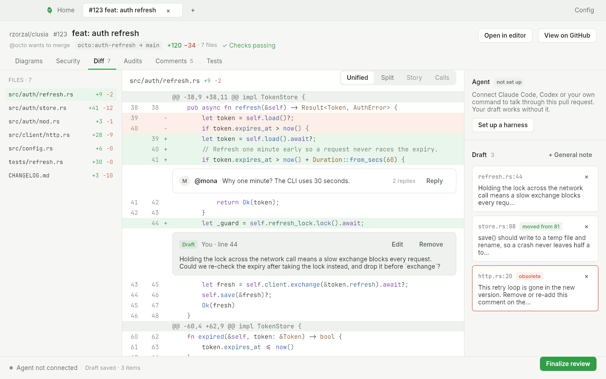
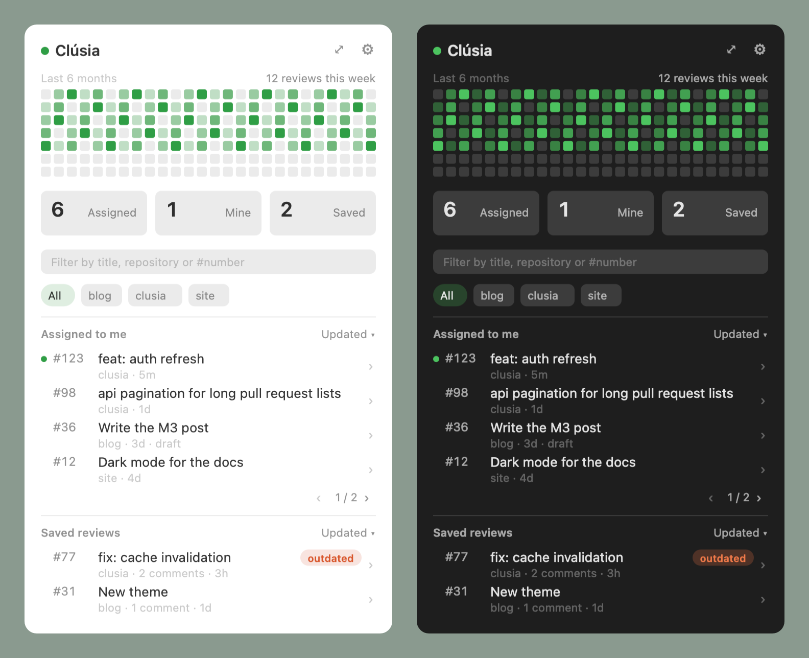
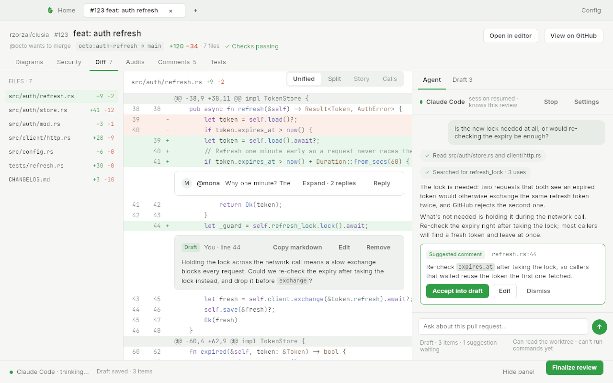
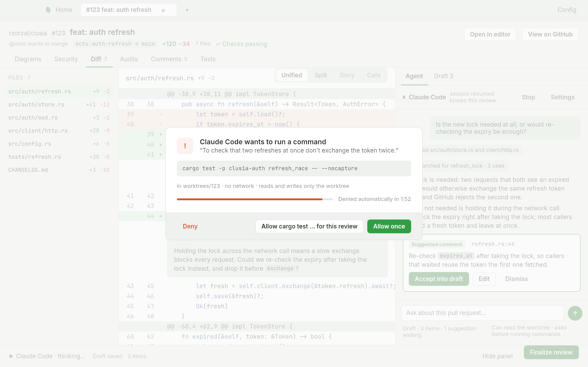
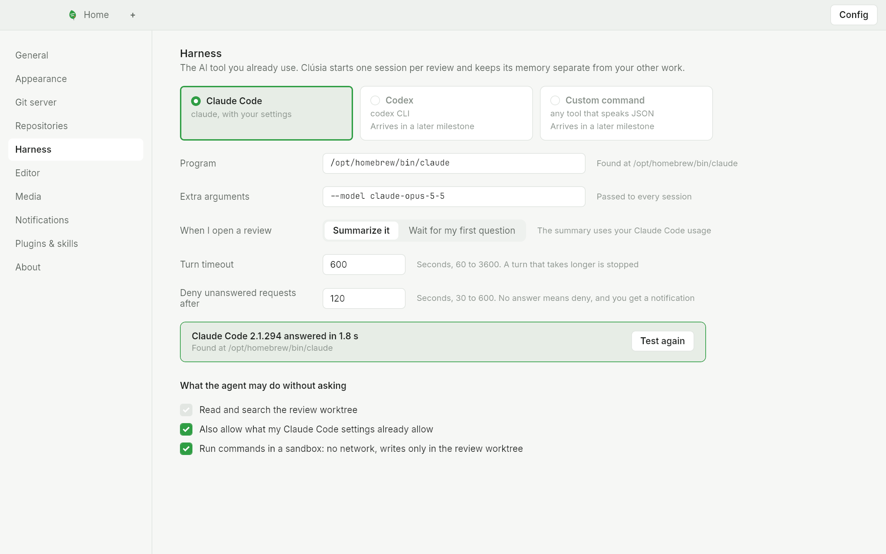
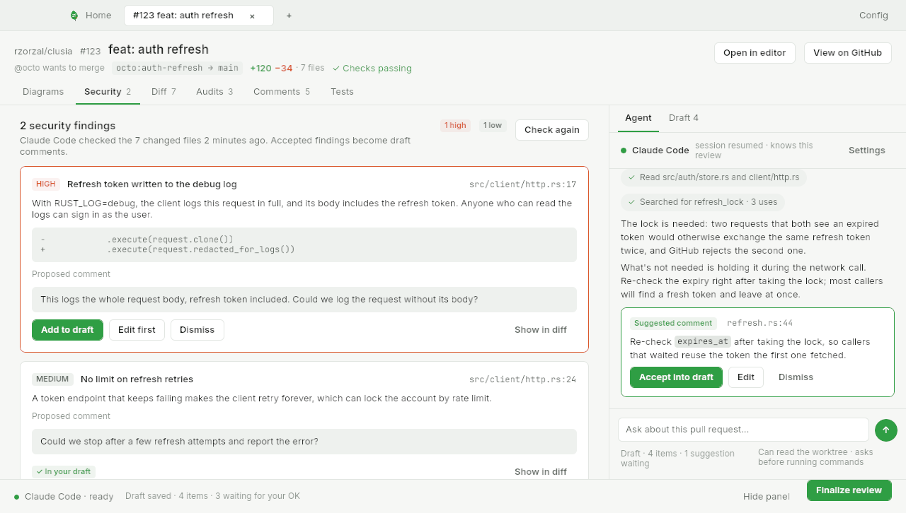
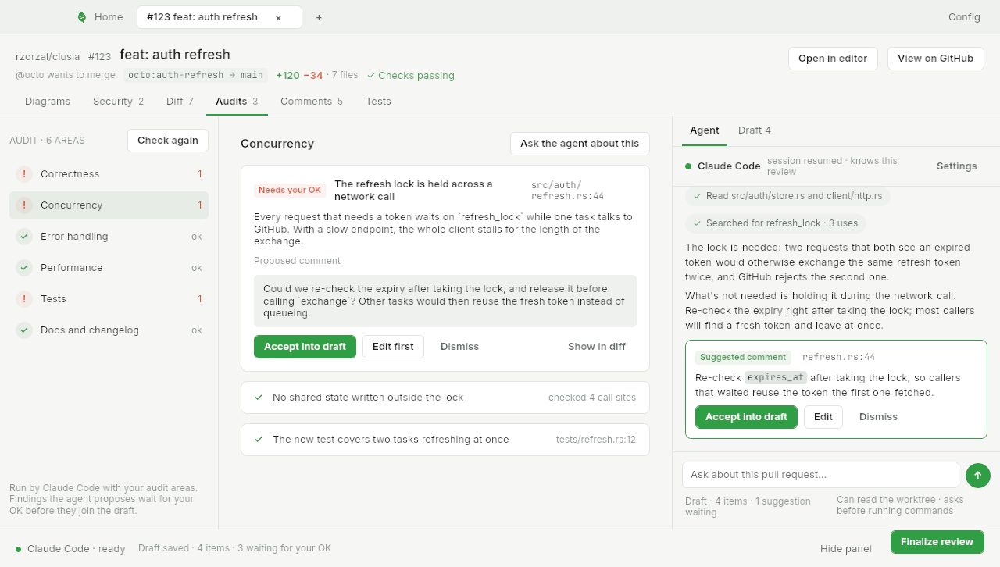
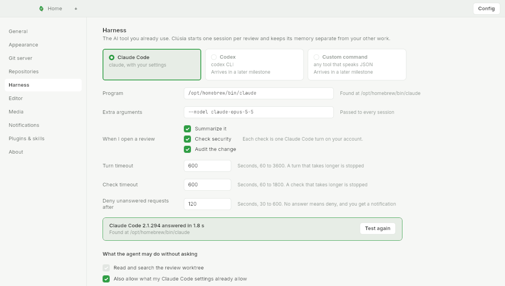
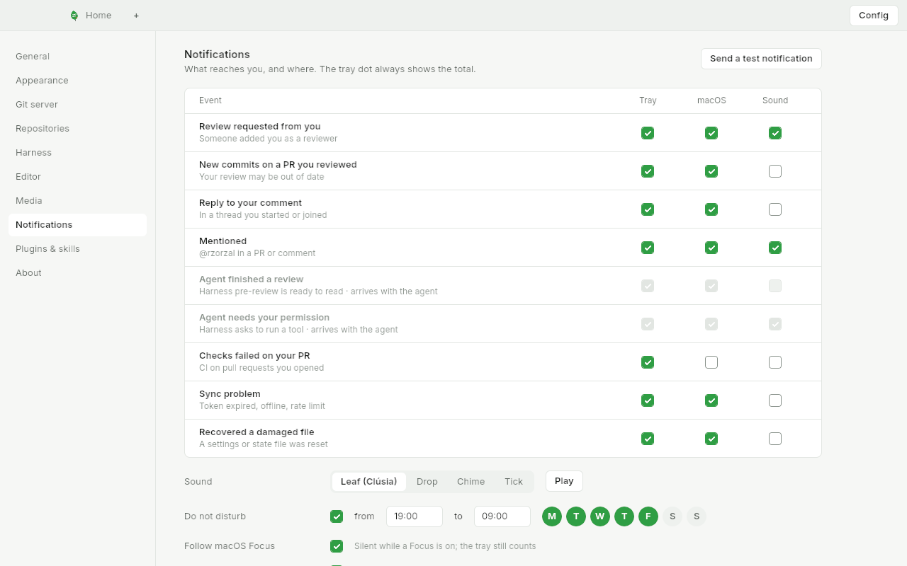

<p align="center">
  <picture>
    <source media="(prefers-color-scheme: dark)" srcset="docs/assets/brand/clusia-mark-dark.svg">
    
  </picture>
</p>

<h1 align="center">Clúsia</h1>
<p align="center"><b>PR Reviews for Humans</b></p>

Clúsia is a macOS app for reviewing pull requests carefully, with your own AI tools at your side. It is free and open source.

- **A review you control.** Open a pull request in a local worktree. Write comments on the diff and keep them as a draft that follows the code when the author pushes again. Publish everything as one GitHub review when you are ready.
- **Your harness, your models.** Claude Code, Codex or a command of your own helps with diagrams, security notes, audits and tests (coming in the next sub-projects). Nothing is sent anywhere you did not choose.
- **Always at hand.** A menu bar popover shows what is waiting for you, which saved reviews went stale and how your review activity looks over the last weeks.

> **Status:** the daemon, the GitHub sync, the review engine, the CLI, the menu bar tray, the main window, notifications and the one-command install work today. The agent and the harness come next. Progress is tracked on the [project board](https://github.com/users/rzorzal/projects/1).

## Install

```sh
curl -fsSL https://raw.githubusercontent.com/rzorzal/clusia/main/install.sh | bash
```

The script:

- builds Clúsia with [Homebrew](https://brew.sh) when you have it, and otherwise directly with Rust (installing the Xcode command line tools and Rust first if they are missing);
- runs `clusia install`, which puts **Clusia.app** in `/Applications` (or `~/Applications`), registers the background service to start at login, and links `clusia` into `/usr/local/bin` (or `~/.local/bin`);
- opens the app.

**Requirements:** macOS on Apple silicon or Intel, about 5 minutes and about 2 GB of free disk for the first build. Homebrew is optional. The script never uses `sudo`.

**Updating:** run the same command again. It replaces the app and keeps your settings and the notification permission.

| Option | Environment | What it does |
|---|---|---|
| `--dry-run` | `CLUSIA_DRY_RUN` | Prints every step and changes nothing |
| `--no-brew` | `CLUSIA_NO_BREW` | Builds directly even when Homebrew is installed |
| `--no-open` | `CLUSIA_NO_OPEN` | Does not open the app at the end |
| `--ref REF` | `CLUSIA_REF` | Installs a branch or tag instead of `main` |

Through the pipe, pass options after `bash -s --`:

```sh
curl -fsSL https://raw.githubusercontent.com/rzorzal/clusia/main/install.sh | bash -s -- --no-brew
```

**Homebrew by hand**, the same two steps the script runs:

```sh
brew install --HEAD rzorzal/clusia/clusia
clusia install --from "$(brew --prefix clusia)/libexec/bin"
```

**Read the script first:**

```sh
curl -fsSL https://raw.githubusercontent.com/rzorzal/clusia/main/install.sh -o install.sh
less install.sh
bash install.sh
```

**From a clone** of this repository (you need Git and the Rust toolchain pinned in `rust-toolchain.toml`):

```sh
cargo run --release -p clusia -- install
```

`clusia install --dry-run` shows what it would do.

## First steps

1. Open **Clusia.app**. The menu bar tray, the background service and the window come up. A few seconds later macOS asks to allow notifications; choose **Allow**.
2. Sign in to GitHub: the window uses your `gh` login, or run `clusia auth login` and give it a personal access token on stdin.
3. On a new machine the window opens on a short first run: connect GitHub, point Clúsia at the folders with your clones, and see which AI harness is installed. Press **Continue**.
4. Open a pull request from the tray, from Home, or with `clusia open owner/repo#123`.
5. Click a line to comment (Shift-click for a range) and reply to or resolve threads. Comments are rich text, with a toolbar, emoji, GIFs (add a Giphy key in Config › Media) and a preview of what GitHub will show.
6. Press **Finalize review**. Everything goes to GitHub as one review; nothing is posted before that. Closing a tab or the window with an unpublished draft asks first.

<p align="center"></p>

<p align="center"></p>

## Everyday commands

Commands that talk to the daemon start it when it is not running; `daemon status`, `daemon stop`, `install` and `uninstall` do not. `clusia --help` lists the rest (`sync`, `worktree`, `activity`, `review status|note|edit|rm|close|discard`). Add `--json` for machine-readable output.

| Command | What it does |
|---|---|
| `clusia auth status` / `login` / `logout` | Show which token is used, store one in the Keychain (read from stdin), or remove it |
| `clusia prs [--assigned] [--mine]` | List pull requests where your review is requested and the ones you opened |
| `clusia open owner/repo#123` | Refresh, prepare the worktree and show what is new (a pull request URL works too) |
| `clusia review comment owner/repo#123 src/lib.rs:42 "text"` | Add a line comment (`path:line` or `path:start-end`) to the draft |
| `clusia review publish owner/repo#123 --verdict approve` | Publish the draft as one review (`approve`, `request-changes`, `comment` or `close`) |
| `clusia ask owner/repo#123 "Is the lock needed?"` | Ask the review's agent; the answer streams, and suggested comments are listed at the end (`file:line  text`). Ctrl-C only detaches: the turn keeps running in the daemon, and `clusia agent stop owner/repo#123` stops it. When the agent needs permission, a terminal asks `[o]nce / [r]eview / [d]eny` (Enter denies; anything typed in the first 300 ms after the question appears is ignored and the question is asked again, so a key aimed at something else never answers it). Ctrl-C at the question only detaches, like anywhere else: the request keeps waiting for the window and is denied when its time ends; without a terminal the request waits for the window or the notification |
| `clusia check owner/repo#123 [--security\|--audit]` | Run the security check, the audit or both on a review and print the findings as `HIGH  client/http.rs:52  title` (grouped by area for the audit). The exit code is 0 when the run finished, even with findings |
| `clusia agent log owner/repo#123` / `agent stop owner/repo#123` | Replay the chat of a review, or stop the turn the agent is running |
| `clusia config get <key>` / `set <key> <value>` | Read or change one setting, for example `github.poll_interval_secs` |
| `clusia daemon status` / `stop` | Show whether the daemon runs, or stop it |
| `clusia install` / `uninstall` | Put the app, the login agent and the `clusia` link in place, or remove them |

## Agent

Clúsia can talk to **your own Claude Code** about the pull request you are reviewing. Install Claude Code and sign in (run `claude` once in a terminal); Config › Harness shows where Clúsia found it and tests it.

- **A chat per review.** Open the **Agent** tab in the right column of the review (⌘\ hides the column; the **Draft** tab is one click away). When you open a review, the agent starts a session and writes a summary; ask it anything after that. The session belongs to the review: close the window and open the review again and the conversation goes on. Publishing or discarding the review ends the session; the chat log stays in the data folder.
- **It reads, you decide.** The agent reads and searches the review's worktree. When it wants to do anything else (run a command, edit or write a file) Clúsia asks you with a **modal** that shows the exact command or path, the reason the agent gave, where it runs and a countdown: **Deny**, **Allow `cargo test …` for this review** (every command that starts with `cargo test`, nothing wider) or **Allow once**. Esc denies; Enter allows once. If you are not looking at the window, a notification (it ignores Do not disturb, because the request expires) opens it on the question, and `clusia ask` asks at the terminal. **No answer means deny**: after the time in Config › Harness (2 minutes by default) the request is denied and the chat says so, and so is everything pending when you press Stop, the turn ends, or you publish, discard or quit. With the sandbox on (the default), the agent cannot write outside the review's worktree, and a request that points outside it is refused without asking. What you allowed for the review is listed under **Allowed for this review** in the chat footer; the **×** takes a rule back, and the rules end with the review. If you also allow what your Claude Code settings already allow (a switch in Config › Harness, on by default), those rules apply, and your own `deny` rules still win. Clúsia never passes a bypass flag, never gives the agent your GitHub token, and turns your Claude Code hooks off for these turns. The agent never writes to git or GitHub; only you publish.
- **What "for this review" can cover.** Only one simple command at a time (no `;`, `|`, `&&`, redirects or substitutions) from a short list of build, test, format and read-only git commands, each with its subcommand: for example `cargo test`, `cargo build`, `npm test`, `go test`, `pytest`, `git status`, `git diff`, `git add`, `mkdir` and `touch`. Anything else gets **Allow once** only, and so does a command whose arguments point outside the worktree. File tools (edit, write) can be allowed for paths inside the worktree.
- **The limits.** A build or a test runs the repository's own code, and the agent may have edited that code, so allowing `cargo test` for a review lets that code run. The check on a command's arguments only sees paths written in the command: it does not follow symlinks inside the worktree, and it does not see paths a program reads from its own config or environment. The sandbox, on by default, is the boundary that keeps commands inside the worktree; turning it off means an allowed build can write elsewhere. With the sandbox off, an allowed command can also act through Clúsia: it runs as you and can reach Clúsia's socket, so it could answer its own requests, add or revoke rules, change the draft or publish with your GitHub account. Turn the sandbox off only for a pull request whose code you trust. If you also allow what your Claude Code settings allow, the commands your own `sandbox.excludedCommands` lists still run outside the sandbox, even though the modal says it is on.
- **A sandbox.** Commands run in a sandbox by default: no network, and writes only in the review's worktree. The agent cannot step out of it: a command it asks to run outside the sandbox is refused without asking you, and no rule allows it. The modal says which one it is; a switch in Config › Harness turns it off, and then the modal says `network allowed · can write outside the worktree`, and Config › Harness warns that an allowed command can then act through Clúsia as you. The setting applies from the next turn; a running turn keeps the one it started with.
- **Suggested comments.** The agent can suggest a comment on a line. It stays a card in the chat until you click: **Accept into draft** adds it to your draft, **Edit** opens the composer in the diff first, **Dismiss** removes it for good. Click a line and **Ask the agent about this line** to start a question about it.
- **Security and audits.** When a review opens, your Claude Code also checks the change for security problems and audits it area by area: Correctness, Concurrency, Error handling, Performance, Tests, and Docs and changelog. Each check is one more Claude Code turn on your account, run in a session forked from the review's session (so it knows what the agent already read, and your chat stays free to answer meanwhile). At most 2 checks run at once across all your reviews; the rest show *Waiting for another check*, and a check stops at the time in Config › Harness (10 minutes by default). Each finding proposes a review comment, and nothing joins the draft until you click: **Add to draft** (or **Accept into draft**) adds it with a *from Security* or *from Audit* mark, **Edit first** opens the composer with the proposal, **Dismiss** removes it for good, and **Show in diff** jumps to the line. A finding on a line the pull request did not change becomes a general comment. A clean result says *Claude Code found no security issues in 7 files*; it never says the change is safe. An area the agent did not answer for reads *Not checked*, never *ok*, and a result for an older commit reads *Checked an older commit* with **Check again**. The text of a finding comes from an agent that has read the pull request's own content, so treat it as a suggestion to verify, not as a verdict. Config › Harness has three boxes under *When I open a review* (**Summarize it**, **Check security**, **Audit the change**); a check that is off shows **Run…** in its tab. The audit areas can be switched off, and you can add your own area with a name and an instruction of up to 500 characters; the instruction is only text for the prompt.
- **Settings.** Config › Harness: the program (found on your `PATH`), extra arguments (for example `--model claude-opus-5-5`), whether to summarize, check security and audit when a review opens (three boxes, each check is one Claude Code turn on your account), the audit areas, the time a check may take, the time a turn may take, how long an unanswered request waits before it is denied, the sandbox switch, and **Test**.

<p align="center"></p>

<p align="center"></p>

<p align="center"></p>

<p align="center"></p>

<p align="center"></p>

<p align="center"></p>

## Notifications and login

Clúsia notifies you when:

- you are asked to review a pull request;
- new commits arrive on a pull request you reviewed;
- someone replies in a thread you started or joined;
- someone mentions you;
- CI fails on a pull request you opened;
- syncing with GitHub has a problem (an expired token, no connection for more than 10 minutes, a rate limit);
- a damaged settings or state file was set aside.

In Config › Notifications each event has its own switches for the tray list, macOS banners and sound. There are four soft bundled sounds (with a preview), **Do not disturb** hours and weekdays, *Follow macOS Focus*, *Group bursts* (updates to one pull request within 2 minutes become one banner), and a button that sends a test notification. Do not disturb silences banners and sound, never the tray list.

Config › General has **Start at login**. **Quit** in the tray stops everything (tray, window and daemon) until you open Clusia.app again.

<p align="center"></p>

## Where things live

| What | Where |
|---|---|
| The app | `/Applications/Clusia.app` (or `~/Applications`) |
| The `clusia` command | a link in `/usr/local/bin` (or `~/.local/bin`) |
| Reviews and settings | `~/Library/Application Support/Clusia` |
| Logs | `~/Library/Logs/Clusia/daemon.log`, `app.log`, `tray.log`, and `daemon.launchd.log` for what the login agent printed |
| The agent's chat logs | `~/Library/Application Support/Clusia/agent/` (one `.jsonl` log and one `.state.json` per review); the agent reads `.clusia/review.md` in each worktree |
| The login agent | `~/Library/LaunchAgents/io.github.rzorzal.clusia.daemon.plist` |

[`docs/daemon.md`](docs/daemon.md) has the environment variables, files and log rotation.

**Privacy:** your GitHub token comes from `gh` or the macOS Keychain and never appears in logs or output. Clúsia talks to GitHub and, if you add a key, to Giphy, and to nothing else (the agent is your own Claude Code, which talks to Anthropic under your account). Your own clone is never checked out or branched: Clúsia only adds refs under `refs/clusia/` and works in separate worktrees.

## Troubleshooting

**No notifications.** Check System Settings › Notifications › Clúsia. Config › Notifications shows the permission Clúsia sees and can send a test.

**`clusia: command not found`.** The link went to `~/.local/bin` and that folder is not on your `PATH`. Add `export PATH="$HOME/.local/bin:$PATH"` to your shell profile.

**The tray is gone after a crash.** Open Clusia.app again. launchd restarts the daemon by itself after a crash.

**The agent says "Install Claude Code or set its path".** Config › Harness › Program: leave it empty to look on your `PATH`, or give the full path of `claude`, then press **Test**.

**The agent says "Run `claude` once in a terminal".** Claude Code is not signed in. Run `claude` in a terminal and sign in, then ask again.

**The agent says a command was denied: "no answer in time".** Nobody answered the permission request within the time in Config › Harness › *Deny unanswered requests after* (2 minutes by default). Ask again, and answer in the window, from the notification or at the terminal. Check System Settings › Notifications › Clúsia if no notification came.

**A command fails with no network.** The sandbox is on: commands run with no network and can only write in the review's worktree. Turn it off in Config › Harness (*Run commands in a sandbox*) if you really need it, and read the modal's last line before you allow anything.

**A check says "Waiting for another check".** Two checks run at once across all your reviews; this one starts when a place is free. **Stop** on a running check frees it.

**A check failed or ran out of time.** The tab shows why and **Try again**. A check stops after the time in Config › Harness › *Check timeout* (10 minutes by default). It never changes your draft by itself.

**The Security tab says "Checked an older commit".** The pull request got a new commit after the check. Press **Check again**; with *Check security* on in Config › Harness it also runs again when you reopen the review.

**Hooks do not run in the agent's chat.** On purpose: your Claude Code hooks (notifiers, sounds) are off for turns Clúsia starts in the background.

**Something looks wrong.** Read the logs in `~/Library/Logs/Clusia`, starting with `daemon.log`.

**Stop everything.** Choose Quit in the tray, or run `clusia daemon stop`.

**Start fresh.** Run `clusia uninstall`, move `~/Library/Application Support/Clusia` to the Trash, and install again. This deletes your saved drafts and settings.

## Uninstall

```sh
clusia uninstall
brew uninstall clusia    # only if you installed through Homebrew
```

`clusia uninstall` removes the app, the login agent and the `clusia` link. Your reviews and settings stay in `~/Library/Application Support/Clusia` until you delete that folder.

Builds from before the ad hoc signing may have left a signing identity in your login keychain. Remove it with:

```sh
security delete-identity -c "Clúsia Local"
```

## The name and the mark

*Clusia* is a genus of tropical American plants, named after the 16th-century botanist Carolus Clusius, who was known for describing plants with great care. In Brazil, *Clusia fluminensis* grows on the restinga, the sandy coast where salt, wind and strong sun leave little else standing. It manages with thick, waxy leaves and with a kind of photosynthesis that takes in air at night to save water.

One of its relatives, *Clusia rosea*, is known as the **autograph tree**: whatever you write on its leaves stays there, without harming the plant. That is what a good review does. It leaves a clear, lasting note on someone else's work and makes it stronger.

The mark is that leaf. The two written lines are review comments, and the orange point is the one thing that still needs attention. The colors carry the same meaning in the app: green for additions and approval, orange for removals and risk.

<p align="center"></p>

Brand files (SVG, menu bar templates at 1× and 2×, app icon `.icns`) live in [`docs/assets/brand`](docs/assets/brand). The accent colors are green `#2F9E44` / `#4CC35F` and orange `#D9572B` / `#F07A4A` (light / dark surfaces).

## How it is built

Clúsia is a Rust workspace with four programs that talk over a local Unix socket:

| Program | What it does |
|---|---|
| `clusiad` | The background service. It syncs with GitHub, manages worktrees, keeps review drafts and publishes reviews. It is the only part that holds state or secrets. |
| `clusia-tray` | The menu bar icon and popover (native AppKit). It is the app you open (Clusia.app), the only part that posts notifications, and it keeps the daemon running. |
| `clusia-app` | The main window (Bevy): Home, Config and the review screen (diff in Unified or Split with syntax colors, rich-text comments with one composer: formatting, emoji, Giphy GIFs, image links and a preview; finalize), plus a first run for a new machine. Opening it starts the daemon if needed, and a second launch brings the open window forward. |
| `clusia` | The command-line interface. |

## Development

Every change passes the same gate:

```sh
cargo fmt --all --check && cargo clippy --workspace --all-targets -- -D warnings && cargo test --workspace
```

Tests never call the real GitHub, the real `gh` or the real Keychain. Other scripts in `scripts/`:

- `m6-check.sh`: the owner check for install, launch and notifications, run on a real Mac with someone at the keyboard (it stops the daemon and the tray);
- `sp2-m1-check.sh --pr owner/repo#N`: the owner check for the agent chat, run on a real pull request with your own Claude Code (it asks first, spends a little of your usage and publishes nothing);
- `sp2-m2-check.sh --pr owner/repo#N`: the owner check for agent permissions, run on a real pull request with your own Claude Code (it asks first, changes three settings and puts them back, makes you answer every request yourself and publishes nothing);
- `flake-hunt.sh [RUNS]`: runs the suites that talk to a daemon over and over and names the tests that failed;
- `leak-check.sh`: runs the whole suite and fails if it leaves a `clusiad` running on a temporary home.

The window runs on demo data, with no daemon and nothing saved, with `target/debug/clusia-app --demo --dark`. Plans and specs live in the GitHub issues: the design spec is [#2](https://github.com/rzorzal/clusia/issues/2).

## Credits

Emoji graphics from [Twemoji](https://github.com/jdecked/twemoji), © Twitter, Inc. and other contributors, licensed under [CC-BY 4.0](https://creativecommons.org/licenses/by/4.0/). Resized for use in Clúsia. Emoji names and shortcodes from [emojibase](https://github.com/milesj/emojibase) (MIT). Fonts: Inter and JetBrains Mono (SIL OFL 1.1). GIF search is powered by [GIPHY](https://giphy.com/). The licences and links are also under Config › About.

## License

[Apache-2.0](LICENSE)
