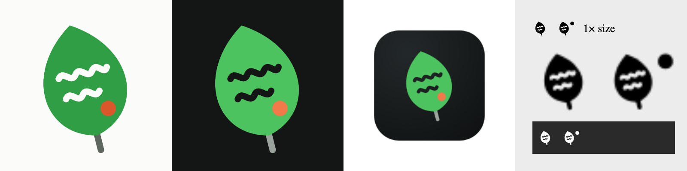

<p align="center">
  <picture>
    <source media="(prefers-color-scheme: dark)" srcset="docs/assets/brand/clusia-mark-dark.svg">
    
  </picture>
</p>

<h1 align="center">Clúsia</h1>
<p align="center"><b>PR Reviews for Humans</b></p>

Clúsia is a macOS app for reviewing pull requests carefully, with your own AI tools at your side. It is free and open source.

- **A review you control.** Open a pull request in a local worktree. Write comments on the diff and keep them as a draft that follows the code when the author pushes again. Publish everything as one GitHub review when you are ready.
- **Your harness, your models.** Claude Code, Codex or a command of your own helps with diagrams, security notes, audits and tests (coming in the next sub-projects). Nothing is sent anywhere you did not choose.
- **Always at hand.** A menu bar popover shows what is waiting for you, which saved reviews went stale and how your review activity looks over the last weeks.

> **Status:** early development, not ready for daily use yet. The daemon, the GitHub sync, the review engine and the CLI work today. The menu bar tray is being built, and the main window comes next. Progress is tracked on the [project board](https://github.com/users/rzorzal/projects/1).

## The name and the mark

*Clusia* is a genus of tropical American plants, named after the 16th-century botanist Carolus Clusius, who was known for describing plants with great care. In Brazil, *Clusia fluminensis* grows on the restinga, the sandy coast where salt, wind and strong sun leave little else standing. It manages with thick, waxy leaves and with a kind of photosynthesis that takes in air at night to save water.

One of its relatives, *Clusia rosea*, is known as the **autograph tree**: whatever you write on its leaves stays there, without harming the plant. That is what a good review does. It leaves a clear, lasting note on someone else's work and makes it stronger.

The mark is that leaf. The two written lines are review comments, and the orange point is the one thing that still needs attention. The colors carry the same meaning in the app: green for additions and approval, orange for removals and risk.

<p align="center"></p>

Brand files (SVG, menu bar templates at 1× and 2×, app icon `.icns`) live in [`docs/assets/brand`](docs/assets/brand). The accent colors are green `#2F9E44` / `#4CC35F` and orange `#D9572B` / `#F07A4A` (light / dark surfaces).

## How it is built

Clúsia is a Rust workspace with four programs that talk over a local Unix socket:

| Program | What it does |
|---|---|
| `clusiad` | The background service. It syncs with GitHub, manages worktrees, keeps review drafts and publishes reviews. It is the only part that holds state or secrets. |
| `clusia-tray` | The menu bar icon and popover (native AppKit). The daemon starts it, and it exits when the daemon stops. |
| `clusia-app` | The main window (Bevy). Coming in a later milestone. |
| `clusia` | The command-line interface. |

Your own clone is never checked out or branched: Clúsia only adds refs under `refs/clusia/` and works in separate worktrees. Your GitHub token comes from `gh` or the macOS Keychain and never appears in logs or output.

## Try it from source

You need macOS, Git, and the Rust toolchain (the version is pinned in `rust-toolchain.toml`).

```sh
cargo build --workspace
target/debug/clusia auth status        # uses your gh login, or: clusia auth login (token on stdin)
target/debug/clusia prs                # pull requests assigned to you and opened by you
target/debug/clusia open owner/repo#123
target/debug/clusia review comment owner/repo#123 src/lib.rs:42 "Is this branch reachable?"
target/debug/clusia review publish owner/repo#123 --verdict request-changes
```

Every `clusia` command starts the daemon when it is not running.

## Development

Every change passes the same gate:

```sh
cargo fmt --all --check && cargo clippy --workspace --all-targets -- -D warnings && cargo test --workspace
```

Tests never call the real GitHub, the real `gh` or the real Keychain. Plans and specs live in the GitHub issues: the design spec is [#2](https://github.com/rzorzal/clusia/issues/2).

## License

[Apache-2.0](LICENSE)
