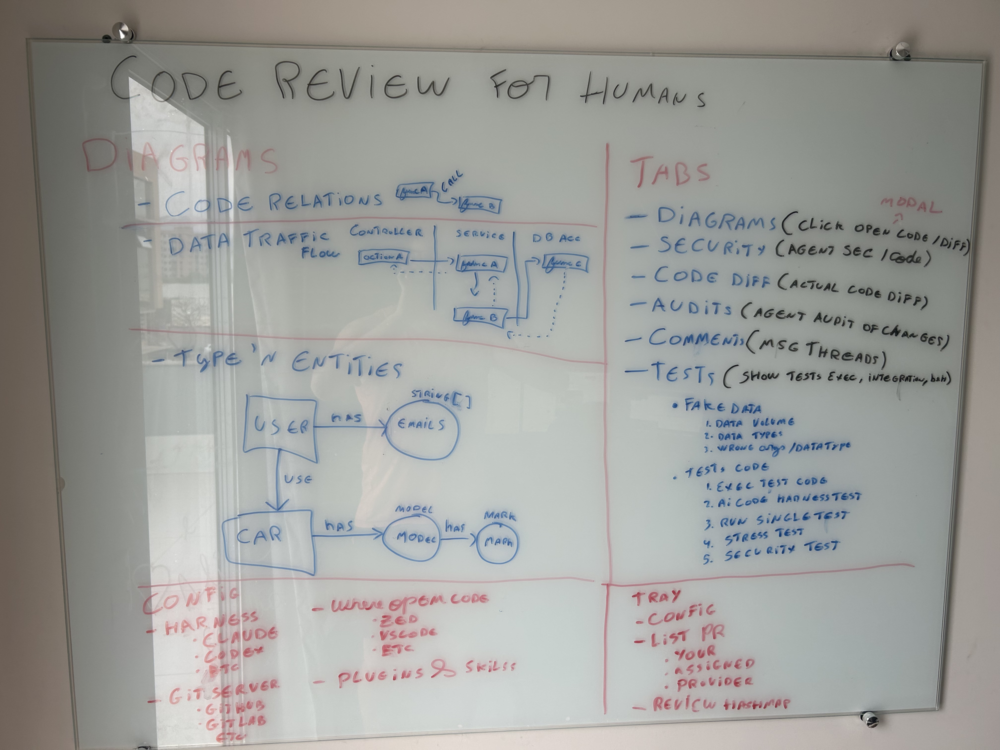

# Clúsia — Design Spec

**Status:** Draft for review · **Date:** 2026-10-02 · **Tracking:** [Project board](https://github.com/users/rzorzal/projects/1), design issue [#2](https://github.com/rzorzal/clusia/issues/2)

> **Clúsia** is a plant of the Brazilian *restinga*: its leaves grow on separate stalks and always point up.
> **Clúsia — PR Reviews for Humans** is a macOS desktop app that helps a human review pull requests faster and better, assisted by the AI harness the human already uses.


---

## 1. Intent

### 1.1 Problem
Reviewing a PR means reading a raw diff and reconstructing in your head what changed, how data flows, and what might break. AI review bots post opinions directly to the PR, which takes judgment away from the reviewer and adds noise.

### 1.2 Outcome
A reviewer opens a PR from the menu bar and gets:
- the real diff and every thread, from every reviewer, in one place;
- AI help that runs on **their own** harness and models (Claude Code, Codex, any CLI): diagrams, security review, audits, tests, and a chat that remembers this review;
- one batched GitHub review that the **human** writes, curates and publishes.

### 1.3 Principles
1. **Humans decide.** The agent proposes; only the human publishes. The agent never writes to GitHub or pushes to git.
2. **Bring your own AI.** Clúsia ships no model. It drives the user's harness with that harness's own permissions.
3. **Efficient.** It lives in the menu bar all day, so idle cost must be close to zero.
4. **Simple and modern.** A minimal UI with light and dark themes and pictures where pictures explain more.

### 1.4 Product constraints
- Open source and free. A possible future enterprise tier (better analytics) means analytics lives in its own module from day one.
- macOS first. Platform-specific code is isolated for later Linux/Windows ports ([#11](https://github.com/rzorzal/clusia/issues/11)).
- Everything in the product is in English: UI, code, docs, issues, commits.
- License: to be decided before the first code commit ([#3](https://github.com/rzorzal/clusia/issues/3)).

### 1.5 Source material
The founding whiteboard, *Code Review for Humans*, defines the diagram types, the review tabs, the config sections and the tray contents:



---

## 2. Scope and decomposition

The full product is too large for one implementation cycle. It is split into sub-projects; each gets its own plan, then gets built.

| # | Sub-project | Delivers | Issue |
|---|---|---|---|
| SP1 | **Core** | Daemon, tray, CLI, GitHub, PR list, Diff, Comments, draft → batched publish, saved reviews, notifications, heatmap, theme, config | [#6](https://github.com/rzorzal/clusia/issues/6) |
| SP2 | **Harness** | Claude Code / Codex / custom sessions per review, agent chat, permissions, Security & Audits tabs, revalidation of saved reviews | [#7](https://github.com/rzorzal/clusia/issues/7) |
| SP3 | **Diagrams** | Agent-generated code relations, data traffic flow, types & entities; 2D/3D rendering | [#8](https://github.com/rzorzal/clusia/issues/8) |
| SP4 | **Tests** | Fake data, running tests, AI-generated tests, stress and security tests, sandboxing | [#9](https://github.com/rzorzal/clusia/issues/9) |
| SP5 | **Reports, plugins & skills** | Report export, plugin system, skills | [#10](https://github.com/rzorzal/clusia/issues/10) |
| — | **Platforms** | Linux & Windows | [#11](https://github.com/rzorzal/clusia/issues/11) |
| — | **Brand** | Logo, app icon, menu bar template icon | [#5](https://github.com/rzorzal/clusia/issues/5) |

This spec defines the **whole architecture** and the **full detail of SP1**. SP2 is specified in detail where SP1 has to anticipate it (the session lifecycle, permissions, the protocol). SP3–SP5 are described at the level needed so SP1 doesn't block them; each gets its own spec before it is built.

---

## 3. Architecture

### 3.1 Processes

```
                launchd LaunchAgent (RunAtLoad, KeepAlive on crash)
                   │
             ┌─────▼──────┐   Unix socket (JSON lines)
             │  clusiad   │   ~/Library/Application Support/Clusia/clusiad.sock
             │  (daemon)  │◄───────────────┬───────────────┬───────────────┐
             └─────┬──────┘                │               │               │
  GitHub polling   │ worktrees      ┌──────┴─────┐  ┌──────┴─────┐  ┌──────┴─────┐
  harness sessions │ state files    │ clusia-tray│  │ clusia-app │  │   clusia   │
  notifications    │ keychain       │ (AppKit)   │  │ (Bevy 0.19)│  │   (CLI)    │
  sound            │                └────────────┘  └────────────┘  └────────────┘
```

Four binaries ship inside a single `Clusia.app` bundle.

| Binary | Responsibility | Lifetime |
|---|---|---|
| `clusiad` | **The only stateful process.** It owns GitHub access, git worktrees, harness sessions, state files, secrets, macOS notifications and sounds. It has no UI and no GPU. | Started at login by launchd and restarted if it crashes. On a clean stop it is not restarted. |
| `clusia-tray` | Menu bar icon and the rich popover. | The daemon spawns it. **It exits as soon as the socket closes**, so the tray is visible only while the system works. The restarted daemon respawns it. |
| `clusia-app` | The main window (Bevy). | Opened on demand from the tray or CLI. Closing the window ends the process. One window with a tab per open review. |
| `clusia` | The CLI. | Runs per command. It offers to symlink itself to `/usr/local/bin/clusia` on first run. |

**Rule:** clients (`tray`, `app`, `clusia`) depend only on `clusia-protocol` and `clusia-core`. They never touch GitHub, git, harnesses or state files directly.

**Why split this way:** a Bevy process keeps a GPU context of tens to hundreds of MB even with no window. Keeping the menu bar presence in a tiny daemon plus a native tray keeps idle cost near zero, lets harness sessions outlive the window (for example, revalidating a saved review when a commit arrives), and isolates UI crashes from state.

### 3.2 Crates (Cargo workspace)

| Crate | Kind | Purpose | Depends on |
|---|---|---|---|
| `clusia-core` | lib | Domain types and pure logic: `PullRequest`, `Review`, `ReviewState`, `Draft`, `DraftItem`, `Anchor`, `Finding`, `Verdict`, `Activity`, `DiagramSpec`. State transitions, anchor relocation, publish payload building. No I/O. | serde |
| `clusia-protocol` | lib | `Request`/`Response`/`Event` types and the JSON-lines codec; version handshake | core |
| `clusia-store` | lib | `config.toml`, review files, `activity.jsonl`, media cache; atomic writes | core |
| `clusia-git` | lib | Local clone discovery, worktree management, PR refs (shells out to `git`) | core |
| `clusia-provider` | lib | `GitProvider` trait plus the GitHub implementation (REST + GraphQL, conditional requests, auth) | core |
| `clusia-harness` | lib | `Harness` trait; Claude Code, Codex and custom command adapters; output schemas; permission bridge (SP2) | core |
| `clusia-analytics` | lib | Activity aggregation for the heatmap and stats (kept separate for a future enterprise tier) | core |
| `clusia-platform` | lib | macOS-only pieces behind traits: Keychain, notifications, sound, launchd, appearance | core |
| `clusiad` | bin | The daemon: orchestration, socket server, schedulers | all libs |
| `clusia-tray` | bin | Tray (objc2 / AppKit) | protocol, core |
| `clusia-app` | bin | Window (Bevy 0.19, native `bevy_ui` + `bevy_ui_widgets`) | protocol, core |
| `clusia` | bin | CLI (clap) | protocol, core |

Workspace lints: `cargo clippy -D warnings` and `rustfmt` are enforced in CI.

### 3.3 Protocol

The protocol runs over a Unix domain socket with one JSON object per line (UTF-8, `\n`-terminated).

```jsonc
// client → daemon, first message
{"type":"hello","protocol":1,"client":"clusia-app","version":"0.1.0"}
// daemon → client
{"type":"welcome","protocol":1,"daemon":"0.1.0"}          // or {"type":"incompatible","daemon_protocol":2}

// request / response
{"type":"request","id":7,"cmd":{"ListPrs":{"filter":"Assigned"}}}
{"type":"response","id":7,"ok":{...}}                     // or "err":{"code":"Unauthorized","message":"..."}

// subscriptions
{"type":"request","id":8,"cmd":{"Subscribe":{"topics":["Prs","Review:rzorzal/clusia#12","Notifications"]}}}
{"type":"event","topic":"Review:rzorzal/clusia#12","event":{"DraftChanged":{...}}}
```

**SP1 commands:** `ListPrs`, `GetPr`, `OpenReview` (runs the load pipeline and streams `LoadStep` events), `CloseReview`, `GetDiff`, `GetThreads`, `AddDraftItem`, `UpdateDraftItem`, `RemoveDraftItem`, `SaveReview`, `DiscardReview`, `Publish`, `GetWhatsNew`, `MarkSeen`, `GetActivity`, `GetConfig`, `SetConfig`, `OpenInEditor`, `FetchMedia`, `DaemonStatus`, `Shutdown`.

**SP1 events:** `PrsUpdated`, `PrUpdated`, `LoadStep`, `DraftChanged`, `ReviewStateChanged`, `ReviewOutdated`, `Notification`, `ActivityAppended`, `ConfigChanged`, `SyncStatus` (online/offline/rate-limited, next sync).

**SP2 additions:** `AgentSend`, `AgentCancel`, `PermissionAnswer`; events `AgentChunk`, `AgentDone`, `PermissionRequested`, `SessionState`, `FindingsProduced`, `RevalidationProduced`.

An incompatible protocol version is refused with a clear message naming both versions. Snapshot tests pin the JSON shape.

---

## 4. Data and state

### 4.1 Files
Root: `~/Library/Application Support/Clusia/`

| Path | Content |
|---|---|
| `config.toml` | All settings (§8) |
| `reviews/<owner>-<repo>-<pr>.json` | One review: state, base/head SHAs at creation, draft items, last-seen markers, harness session id |
| `activity.jsonl` | Append-only log: `{ts, kind, repo, pr, ...}` (review opened, item added, published, ...). It feeds the heatmap and stats. |
| `cache/media/<sha256>` | Downloaded images and GIFs |
| `cache/prs.json` | Last known PR lists, used for offline display and while loading |
| `repos/<owner>/<repo>/` | Clones made by Clúsia when no local clone exists |
| `worktrees/<owner>-<repo>-<pr>/` | One worktree per reviewed PR |
| `clusiad.sock` | The socket |

Logs: `~/Library/Logs/Clusia/{daemon,app,tray}.log` (`tracing`, daily rotation, 7 days).

**Secrets:** the GitHub token is never written to disk by Clúsia. It is stored in the macOS Keychain, or read from `gh auth token`.

**Atomic writes:** each write goes to `file.tmp`, then fsync, then rename. If a file can't be parsed, it is renamed to `*.corrupt-<ts>`, the user is notified, and Clúsia continues with an empty default.

### 4.2 Core domain

```rust
enum ReviewState { Active, Saved, Outdated, Revalidated, Publishing, Published, Discarded }

struct DraftItem {
    id: Uuid,
    kind: DraftKind,          // LineComment | Thread | Finding
    origin: Origin,           // Human | Audit | Security | Diagram
    anchor: Option<Anchor>,   // path + line range + side + commit SHA it was written against
    body: Markdown,           // GitHub-flavored markdown: emoji, image/GIF URLs, code
    status: ItemStatus,       // Ok | Moved | Obsolete{reason} | AgentEdited{previous}
    accepted: bool,           // agent-originated items require explicit acceptance
}

enum Verdict { Approve, RequestChanges, Comment, ClosePr /* owner only */ }
```

---

## 5. Integrations

### 5.1 GitHub (`GitProvider`)
- **Auth order:** (1) `gh auth token` if `gh` is installed and logged in, (2) a PAT stored in the Keychain. Config shows which source is in use and the token scopes.
- **Polling:** default 60 s, configurable. It uses `ETag` / `If-None-Match`, so a 304 does not count against the rate limit. It respects `Retry-After` and the rate-limit reset.
- **PR lists:** *Assigned* (review requested from me), *Mine* (authored by me), and *By provider* (the account/host, ready for more providers).
- **Read:** PR metadata, files and diff, commits, reviews, review comments, issue comments, check runs.
- **Publish:** a single `POST /repos/{o}/{r}/pulls/{n}/reviews` with `event` (APPROVE / REQUEST_CHANGES / COMMENT), `body` and the line `comments[]`. Standalone threads are sent as review comments or issue comments as appropriate. **ClosePr** (owner only) posts a COMMENT review, then `PATCH state=closed`. GitHub forbids approving your own PR, so the Finalize modal offers only *Comment* or *Close PR* to the owner.
- **Images:** only URLs are accepted in posted markdown. GitHub strips `data:` URIs and limits a body to 65,536 characters, so base64 is not viable. Uploading to a configured destination is in the backlog.

### 5.2 Git (`clusia-git`)
- **Discovery:** scan the configured repo roots (default `~/Repos`, `~/Projects`, `~/src`, `~/code`) to a limited depth and match any remote URL to the PR's repo (normalizing ssh and https forms). The matched path is cached in config.
- **Worktree:** `git fetch <remote> pull/<n>/head:clusia/pr-<n>`, then `git worktree add <worktrees>/<owner>-<repo>-<pr> clusia/pr-<n>`. **The user's working tree and current branch are never touched.** On a new head the worktree is fast-forwarded or reset. Worktrees are pruned when a review is published or discarded, and after 14 days of inactivity.
- **Fallback:** if no local clone exists, Clúsia clones into `repos/` (a partial clone, `--filter=blob:none`).

### 5.3 Harness (`Harness` trait) — SP2, anticipated by SP1

```rust
trait Harness {
    async fn start(&self, ctx: SessionContext) -> Result<Session>;   // cwd = worktree
    async fn resume(&self, id: &SessionId, ctx: SessionContext) -> Result<Session>;
}
trait Session {
    async fn send(&mut self, msg: AgentInput) -> Result<()>;
    fn events(&mut self) -> impl Stream<Item = AgentEvent>;   // chunks, tool use, permission requests, done
    async fn stop(self) -> Result<SessionId>;
}
```

- **Adapters:** Claude Code (`claude --input-format stream-json --output-format stream-json`, `--resume <id>`), Codex (exec/resume JSON mode or its app-server protocol), and a **custom command** that speaks Clúsia's JSON-lines agent protocol (the plugin entry point).
- **One live session per open review**, owned by the daemon. All agent interaction for that review (chat, audits, diagrams, revalidation) goes to it.
- **Memory isolation per review:** the harness runs with cwd = that PR's worktree, so the native per-directory memory is separate. Clúsia also maintains `.clusia/review.md` inside the worktree (git-excluded via `info/exclude`): PR metadata, a running summary, decisions, accepted and rejected findings. Any harness reads it, so switching harness mid-review keeps context.
- **System prompt:** the agent's role is a review assistant for a human. Structured outputs follow JSON schemas (findings, audits, diagram specs, revalidation results). It must not write to git or GitHub. The GitHub token is never passed to the agent.
- **Lifetime:** the session starts when a review opens. After the window closes it stays alive for an idle timeout (default 10 min), then stops with its session id saved, and reopening the review resumes it. On a crash it auto-resumes up to 3 times, then the state is `Failed`, with logs shown.
- **Permissions:** when the harness asks for a permission (run a command, read outside the worktree, network access), the request goes to the UI as a modal with the exact tool, command or path and the agent's stated reason. The choices are **Allow once / Always for this review / Deny**. Claude Code uses `--permission-prompt-tool`, pointed at a small MCP server hosted by the daemon. Codex uses its approval protocol. If the window is closed, a notification opens the window on the modal. An unanswered request is denied after 5 min (configurable). Clúsia never grants more than the user's harness config allows.

---

## 6. Review lifecycle

```
           open PR
              │
          ┌───▼───┐  leave with content   ┌───────┐  new head SHA  ┌──────────┐
          │Active ├──────────────────────►│ Saved ├───────────────►│ Outdated │
          └───┬───┘◄──────reopen──────────┴───┬───┘                └────┬─────┘
              │ finalize                      │ publish                 │ agent revalidates (SP2)
          ┌───▼───────┐                       │                    ┌────▼────────┐
          │Publishing │◄──────────────────────┴────────────────────┤ Revalidated │
          └───┬───────┘                                            └─────────────┘
     ok ┌─────┴─────┐ error → back to Saved + notice (nothing lost)
   Published     Discarded (file and worktree removed)
```

### 6.1 Opening (load pipeline)
Opening a review always refreshes remote data. The window shows an animated Clúsia leaf: one leaf grows up its own stalk for each step.
1. **Repo:** locate the local clone or clone it.
2. **Branch:** fetch the PR head and create or update the worktree.
3. **PR:** metadata, commits, files, reviews, comments and checks, fresh from GitHub.
4. **Agent** (SP2): start or resume the review's session.

Cached data is shown underneath while loading. If a step fails, its leaf turns orange and shows the reason (including git stderr), with **Retry** and **Open from cache**.

### 6.2 What's new modal
After loading, if anything happened since the user last saw this review, a modal lists each event with **what**, **from where** and **who**:

```
◆ 2 new commits           GitHub            @maria
💬 3 comments              GitHub            @joao
✓ CI passed               GitHub Actions
⟳ Draft revalidated: 2 moved, 1 obsolete   Agent (Claude)
✎ Item added              You via CLI
```

Each row navigates to the place it refers to. The modal is skipped when nothing is new. `last_seen` is stored per review.

### 6.3 Drafting
- Draft items come from: clicking a diff line (line comment); a new thread in Comments; a diagram node modal (SP3, anchored to a code location); accepting an Audit or Security finding (SP2).
- Agent-originated items need explicit acceptance before they count.
- Bodies are GitHub-flavored markdown with emoji, image and GIF URLs, and code blocks.
- The draft is auto-saved on every change.

### 6.4 Finalizing
**Finalize review** opens a modal: all draft items, editable, plus the verdict and a summary body. The choices are **Publish**, **Save for later** or **Discard**. Publishing is one API call, so on failure the review returns to *Saved* and nothing is lost.

### 6.5 Leaving without deciding
When the window or review tab closes while the draft has content and no decision was made, the draft is already saved. A prompt asks *Publish / Keep for later / Discard*. If dismissed, the tray keeps a reminder on the review.

### 6.6 New commits on a saved review (SP2)
1. Polling sees a new head SHA: the review becomes *Outdated* and the tray shows ⚠.
2. The daemon updates the worktree, resumes the review's session, and sends the old→new diff plus the draft items.
3. The agent returns, per item: keep / move (new anchor) / obsolete (reason) / suggest new text.
4. The review becomes *Revalidated*. A notification says, for example, "Review #77 revalidated: 2 moved, 1 obsolete". The user accepts or rejects each change.

In SP1 (without a harness), anchors are relocated deterministically by diff mapping (`clusia-core`). Items that can't be mapped are marked *Obsolete* for the user to handle.

### 6.7 Other people's reviews
The Comments tab shows all reviews and threads from all participants, with the ability to reply. The agent receives them as context (SP2).

---

## 7. User interface

### 7.1 Visual language
- **Feel:** minimal, modern, efficient. Lots of space, few borders; hierarchy comes from surface tone.
- **Themes:** Light, Dark, or System. System follows the macOS appearance live, including *Auto* (time of day), through winit theme-change events. Tokens are defined twice (light/dark) in one `theme` module. Screens never use literal colors.
- **Palette:** a neutral base (near-black and greys in dark; off-white and greys in light). **Clúsia green** marks primary actions, additions and success; **Clúsia orange** marks removals, risk and warnings. The accents come from the logo.
- **Type:** Inter for UI and JetBrains Mono for code (both OFL, bundled).
- **Metrics:** 4 px spacing unit, 6 px corner radius, motion ≤ 150 ms and only for state changes.
- **Efficiency:** Bevy runs in reactive mode (`WinitSettings::desktop_app()`), redrawing only on input or events.
- **Rich text:** a markdown renderer (`pulldown-cmark`) builds UI nodes. Images and GIFs are fetched by the daemon (`FetchMedia`, authenticated for GitHub attachments; the token never reaches the app), and GIFs are decoded per frame and animated. Color emoji come from a bundled image atlas (Twemoji, CC-BY 4.0), so they don't depend on the text renderer's color emoji support.

### 7.2 Main window

```
┌──────────────────────────────────────────────────────────────────┐
│ ◐ Clúsia   [#123 auth-fix ×] [#98 api ×] [+]             ⚙  ◑   │  review tabs
├──────────────────────────────────────────────────────────────────┤
│ rzorzal/clusia #123 · feat: auth refresh    +120 −34 · 7 files  │  PR header
│ Diagrams  Security  Diff  Audits  Comments  Tests                │  review sections
├───────────────────────────────────────────────┬──────────────────┤
│                                               │ Agent            │
│               section content                 │ (review session  │
│                                               │  chat)           │
│                                               ├──────────────────┤
│                                               │ Draft · 4        │
├───────────────────────────────────────────────┴──────────────────┤
│ ● session active (Claude)    draft saved          [Finalize review]│
└──────────────────────────────────────────────────────────────────┘
```

- **Home** (no review open): activity heatmap, Assigned / Mine / Saved lists, and quick stats (pending PRs, average review time, reviews this week).
- **Right panel (collapsible):** the agent chat on top (SP2; in SP1 an empty state pointing to Harness config) and the draft list below.
- **Diff (SP1):** a file tree with per-file stats on the left, and a unified or split diff with `tree-sitter` highlighting on the right. Click or drag over lines to comment. Existing threads appear inline. *Open in editor* opens file:line in the configured editor.
- **Comments (SP1):** threads from everyone, grouped by file and general discussion. Reply, resolve and new thread actions go to the draft.
- **Diagrams / Security / Audits / Tests (SP1):** placeholder states naming their sub-project, so the layout is final from day one.
- **Config:** see §8.

Visual mockups (light and dark) for all screens are produced and approved before SP1 UI work ([#12](https://github.com/rzorzal/clusia/issues/12)).

### 7.3 Tray popover
The popover is native AppKit through `objc2`: `NSStatusItem` + `NSPopover` + `NSVisualEffectView`. This gives the macOS glass look of the system *Now Playing* popover, opens instantly, uses little memory, and follows the system appearance. Custom views are drawn with CoreGraphics.

```
╭──────────────────────────────────────────╮
│ ◐ Clúsia                        ⚙   ⤢   │
│ ▢▢▣▢▣▣▢▢▣▣▣▢▣▢▢▣▣▣▣▢▣▢   12 reviews/wk    │  activity heatmap (~16 weeks)
│ ┌───────┐ ┌───────┐ ┌───────┐            │
│ │ 3     │ │ 2     │ │ 1     │            │  Assigned · Mine · Saved
│ │Assign.│ │ Mine  │ │ Saved │            │
│ └───────┘ └───────┘ └───────┘            │
│ Assigned to me                           │
│ ● #123 feat: auth refresh    repo · 2h › │  ● = new activity
│   #98  api pagination        repo · 1d › │
│ Saved reviews                            │
│ ⚠ #77 fix cache   outdated (2 commits)  › │
╰──────────────────────────────────────────╯
```

- It shows the same information as Home, in compact form. Clicking a PR opens the window on that review; ⤢ opens Home and ⚙ opens Config.
- The menu bar icon is a monochrome template image, with a dot variant for new activity.
- All data arrives by subscription from the daemon. The tray never fetches anything itself.
- The tray's logic (view models) is separated from its AppKit layer so it can be tested.

### 7.4 Notifications
On a PR interaction (new commit, comment, review, review request, CI change, saved review outdated, agent permission request), the daemon emits any combination of: **tray badge/dot**, **macOS notification** (clicking it opens the relevant place), and **sound**. Each event type can be configured separately, and a *Do not disturb* toggle is available.

---

## 8. Configuration (`config.toml` + Config screen)

| Section | Settings |
|---|---|
| Appearance | Theme: Light / Dark / System |
| Git server | Provider (GitHub in SP1), host (github.com or Enterprise URL), auth source (gh / PAT), token status and scopes |
| Repositories | Roots to scan, discovered repo ↔ path mappings (editable), worktree retention |
| Harness | Kind (Claude Code / Codex / Custom), binary path, extra args, idle timeout, permission timeout (SP2; visible in SP1 as setup) |
| Editor | Zed / VS Code / Cursor / custom command template (`{path}`, `{line}`) |
| Notifications | Per event: tray / macOS / sound; sound choice; polling interval; Do not disturb |
| Plugins & skills | Placeholder (SP5) |

---

## 9. CLI

```
clusia prs [--assigned|--mine] [--json]
clusia open <owner/repo#n | url>
clusia review status|publish|discard <pr> [--verdict approve|changes|comment]
clusia ask <pr> "question"                  # SP2: talk to the review's agent session
clusia config get|set <key> [value]
clusia daemon start|stop|status|logs [-f]
```

Output is human-readable by default and machine-readable with `--json`. If the daemon is not running, the CLI prints `Clúsia daemon not running` and suggests `clusia daemon start`.

---

## 10. Error handling

Every error appears somewhere visible, together with an action to resolve it.

| Failure | Behavior |
|---|---|
| Daemon down | App/CLI show "daemon not running" with the start command; the tray doesn't exist (it exits with the daemon) |
| Protocol mismatch | The client refuses with both version numbers |
| Invalid or expired token | Config banner and notification; polling pauses until fixed |
| Rate limited | Wait for the reset; UI shows "next sync at HH:MM" |
| Offline | Cache shown with an *offline* badge; resync on reconnect |
| Publish fails | Single atomic call; review returns to *Saved*, nothing lost |
| Git/worktree failure | Load step turns orange with git stderr; Retry |
| Harness crash (SP2) | Auto-resume ×3, then *Failed* with logs |
| Corrupt state file | Renamed `*.corrupt-<ts>`, user notified, defaults used |
| Permission request unanswered (SP2) | Denied after the timeout; the agent is told |

---

## 11. Testing strategy

Development is TDD throughout. CI runs on GitHub Actions (macOS): `cargo fmt --check`, `cargo clippy --all-targets -D warnings`, `cargo test`.

| Unit | How |
|---|---|
| `core` | Pure unit tests: state transitions, anchor relocation, publish payload, verdict rules (owner can't approve) |
| `protocol` | Serde round-trip of every message, JSON snapshot tests (`insta`) |
| `store` | Temp dirs: atomic writes, corrupt-file recovery, activity aggregation |
| `provider` | `wiremock` with recorded GitHub fixtures: ETag/304, rate limit, publish payload. Opt-in live test behind `CLUSIA_E2E=1` |
| `git` | Real temp repos: discovery, remote matching, worktree add/update/prune, PR ref fetch |
| `harness` (SP2) | A fake harness binary speaking stream-json: sessions, resume, crash, permissions, without spending tokens |
| `clusiad` | Integration tests: daemon on a temp socket, driven by a protocol client |
| `clusia-app` | Bevy systems under `MinimalPlugins`: screen logic and state; no pixel tests |
| `clusia-tray` | View-model unit tests; manual checklist for the AppKit layer |

---

## 12. Future (outside SP1, recorded so SP1 doesn't block them)

- **SP3 diagrams:** the agent emits a `DiagramSpec` (nodes with code anchors, edges with kind call/data/has/uses, optional layers/swimlanes, and change markers). Clúsia lays it out (layered for flow, force-directed for relations) and renders it in 2D/3D in Bevy. Clicking a node opens a modal with code/diff, a comment field and Open in editor. Diagrams regenerate on new commits, with a diff between versions.
- **SP4 tests:** running untrusted PR code requires sandboxing and explicit consent. It gets its own spec before building.
- **SP5:** report export (HTML/PDF), plugin system, per-repo skills passed to the harness.
- **Backlog:** image upload to a configured destination; GitLab, Gitea and Bitbucket providers; Linux/Windows.

## 13. References

- Bevy 0.19 — https://docs.rs/bevy/0.19 · bevy_ui_widgets — https://docs.rs/bevy_ui_widgets
- objc2 / AppKit — https://docs.rs/objc2-app-kit · NSPopover — https://developer.apple.com/documentation/appkit/nspopover · NSVisualEffectView — https://developer.apple.com/documentation/appkit/nsvisualeffectview
- launchd jobs — https://developer.apple.com/library/archive/documentation/MacOSX/Conceptual/BPSystemStartup/Chapters/CreatingLaunchdJobs.html
- GitHub: create review — https://docs.github.com/en/rest/pulls/reviews#create-a-review-for-a-pull-request · conditional requests — https://docs.github.com/en/rest/using-the-rest-api/best-practices-for-using-the-rest-api
- git worktree — https://git-scm.com/docs/git-worktree
- Claude Code headless — https://docs.claude.com/en/docs/claude-code/headless · CLI reference — https://docs.claude.com/en/docs/claude-code/cli-reference
- Codex CLI — https://github.com/openai/codex
- pulldown-cmark — https://docs.rs/pulldown-cmark · tree-sitter-highlight — https://docs.rs/tree-sitter-highlight · Twemoji — https://github.com/jdecked/twemoji
